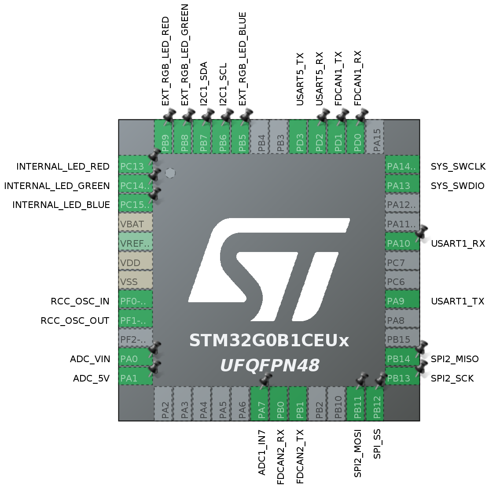

# RaccoonLab GNSS ZED-F9P v3

This is a template repository for RaccoonLab GNSS ZED-F9P v3.

The core of this repository is [the .ioc file](gps_mag_baro_v3.ioc) that defines the stm32 peripherals with respect to what a real device has. 

The peripheral configuration is shown below:

Additionally, the reposity has a source code generated with `STM32CubeMX v6.6.0` for `STM32CubeIDE` usage.

Feel free to write your own custom firmware to test some features or suggest something.

The entry point is [Core/Src/main.c](Core/Src/main.c). This file initializes all the peripherals and then goes to `application_entry_point()`. This is where a custom user logic is expected to be implemented.

Reference:
- [hardware](https://github.com/RaccoonLabHardware/GPS-MAG-BARO),
- [docs](https://docs.raccoonlab.co/guide/gps_mag_baro/gps_l1_l2_zed_f9p.html).
